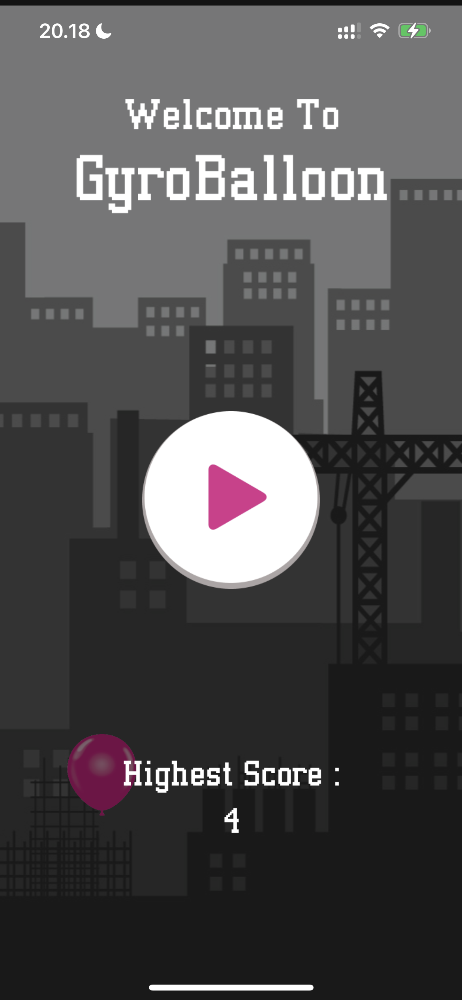

# GyroBalloon
GyroBalloon is a simple game that utilizes the gyroscope sensor. The game play is that players must be able to control balloons by tilting their iPhone to avoid existing obstacles.

## Frameworks
* SwiftUI
* SpriteKit
* CoreMotion

## Game UI
| Home | Game Play | Game Over |
| :---------: | :---------: | :---------: |
|  |  |  |
